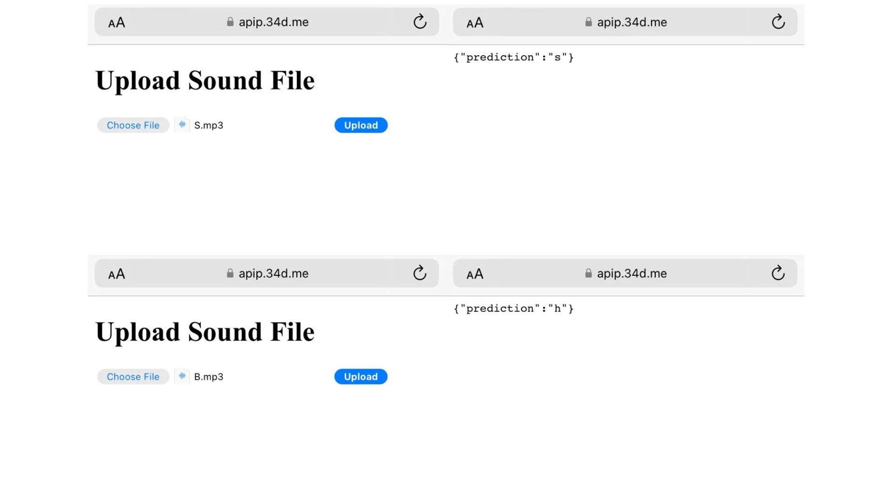

# Phonics Speech Recognition Using Machine Learning
*A speech recognition project to identify English Phonics using machine learning with MFCC Extraction*


## Table of Contents
1. [Project Overview](#project-overview)
2. [Tech Stack](#tech-stack)
3. [Model Choice and Evaluation](#model-choice-and-evaluation)
6. [Installation](#installation)
7. [Result](#results)

## Project Overview

This is a project on Speech Recognition, focusing on predicting the 26 alphabet sounds (Phonics) using machine learning models. It was developed as part of my undergraduate thesis, with the primary goal of helping systems better understand spoken letters from both native and non-native English speakers. The model was trained using MFCC features extracted from audio recordings and evaluated across different classification algorithms to determine the most accurate one. The project specifically targets the recognition of phonetic sounds from the English alphabet for educational purposes, particularly to support language learning.

The dataset consists of ``26 phonics (A–Z)`` collected from:
- **Native speakers**, sourced from YouTube videos and phonics pronunciation websites.
- **Non-native speakers**, recorded from 10 volunteers (Indonesian students) with different ethnic backgrounds—such as Javanese and Melayu to observe whether there are differences in how the English alphabet is pronounced across local accents.
  
## Tech Stack

**Programming Language**: Python

**Libraries**:
- scikit-learn 
- librosa 
- joblib 
- numpy 
- pandas 
- matplotlib 

## Model Choice and Evaluation

In the development of this project, I tested three machine learning models to determine the best fit for phonics speech classification:

1. **Support Vector Machine (SVM)**: Best-performing model with the highest accuracy, especially when working with **high-dimensional MFCC features**.
2. **Random Forest (RF)**: A strong performer, but it did not match SVM in terms of accuracy.
3. **K-Nearest Neighbors (KNN)**: Struggled with **high-dimensional data** and performed slower compared to other models.

Ultimately, **SVM** was chosen for its precision and ability to handle the feature complexity in phonics recognition.


## Installation

1. **Clone the Repository**
First, clone the repository to your local machine:
```
git clone https://github.com/your-username/phonics-recognition.git
cd phonics-recognition
```

2. **Install Dependencies**
You can install required dependencies manually:
```
pip install joblib scikit-learn librosa numpy
```

3.  **Running the Project**
```
python predict.py
```

## Results

The **SVM model** outperformed **Random Forest** and **K-Nearest Neighbors** in predicting phonics sounds with the highest accuracy. Below are a few visual comparisons between **correct and incorrect predictions**:

- **Correct Prediction**:  
  - **Predicted:** 's'  
  - **Actual:** 's'
  
- **Incorrect Prediction**:  
  - **Predicted:** 'h'  
  - **Actual:** 'b'



This shows the strength of the **SVM** model in recognizing subtle phonetic differences.


